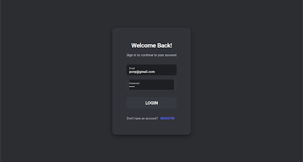
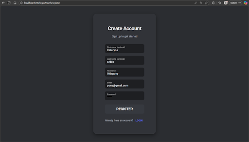
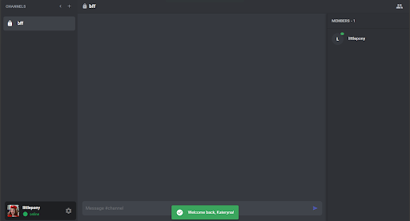
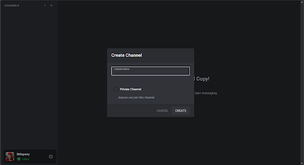
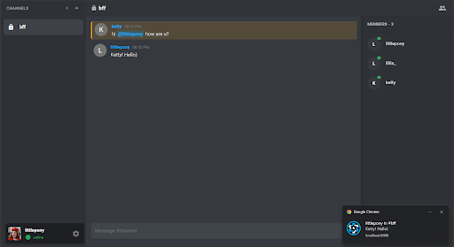
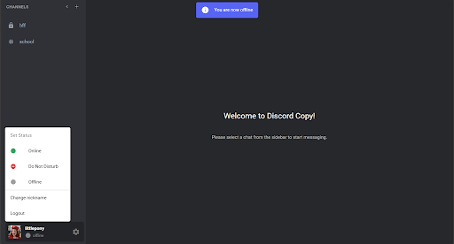

# VPWA Frontend

IRC-style text communication application (Slack)

## Screenshots

### Authentication

**Login**



**Registration**



### Basic functionality

**Main chat view**



**Creating a channel**



**Notification**



**Change of status**



## API Endpoints

### Authentication (`/api/auth`)

- `POST /register` - Register a new user
- `POST /login` - User login (returns token)
- `POST /logout` - User logout
- `GET /me` - Get current user information

### Channels (Commands) (`/api/channels`)

- `GET /channels` - List all user's channels
- `POST /channels` - Create a new channel
- `POST /channels/join` - Join a public channel
- `DELETE /channels/:id` - Delete a channel (admin only)
- `POST /channels/:id/leave` - Leave a channel
- `GET /channels/:id/members` - List channel members
- `POST /channels/:id/invite` - Invite user to channel (unbans if banned)
- `POST /channels/:id/kick` - Kick from public channel (3 votes = ban, admin = instant ban)
- `POST /channels/:id/revoke` - Revoke access in private channel (admin only)

### Messages (`/api`)

- `POST /messages` - Send a message to a channel
- `GET /channels/:id/messages` - Load message history (with pagination)

### Invites (`/api/invites`)

- `GET /invites` - List pending invites
- `POST /invites/:id/accept` - Accept an invite
- `POST /invites/:id/reject` - Reject an invite

### Users (`/api/users`)

- `GET /users/:id` - User details
- `PUT /users/status` - Change status (online/offline/DND)
- `PUT /users/settings` - Update notification settings

### Notifications (`/api/notifications`)

- `GET /notifications` - List notifications (with pagination, unread filter)
- `PUT /notifications/:id/read` - Mark notification as read
- `PUT /notifications/read-all` - Mark all as read
- `DELETE /notifications/:id` - Delete a notification

### Admin (`/api/admin`)

- `POST /admin/cleanup` - Manually trigger cleanup (testing)
- `POST /admin/create-old-channel` - Create an old channel (testing)

## Install the dependencies

```bash
npm install
```

### Start the app in development mode (hot-code reloading, error reporting, etc.)

```bash
# to use it you need to install quasar cli
quasar dev
# or just use
npx quasar dev
```

### Lint the files

```bash
npm run lint
```

### Format the files

```bash
npm run format
```

### Build the app for production

```bash
quasar build
```

### Customize the configuration

See [Configuring quasar.config.js](https://v2.quasar.dev/quasar-cli-vite/quasar-config-js).
